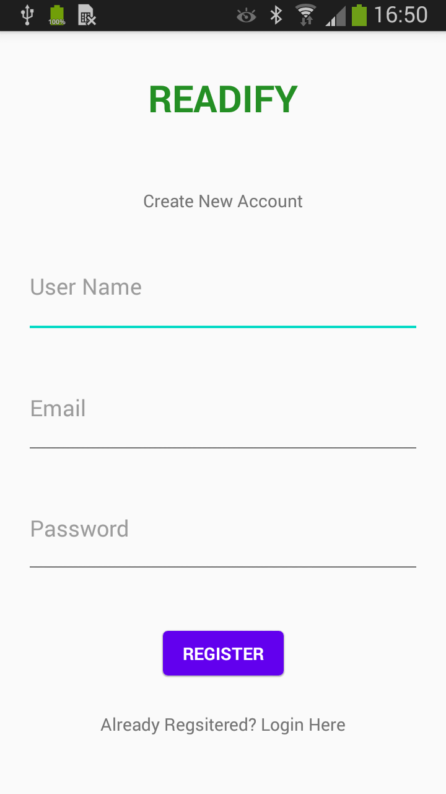
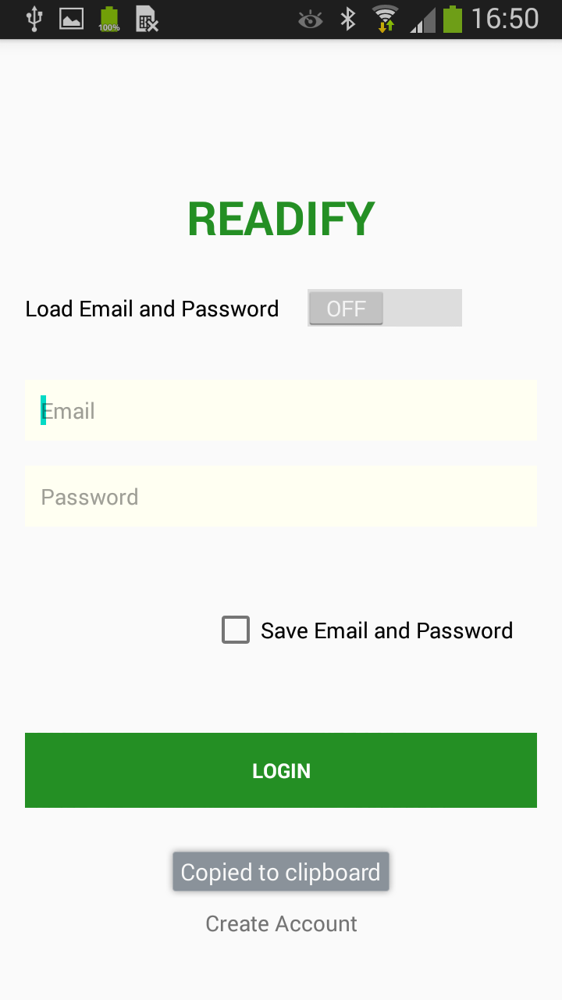
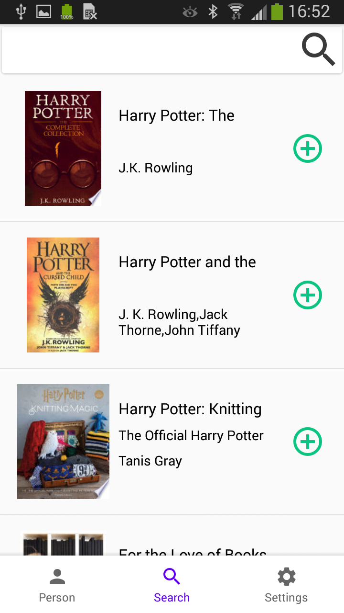
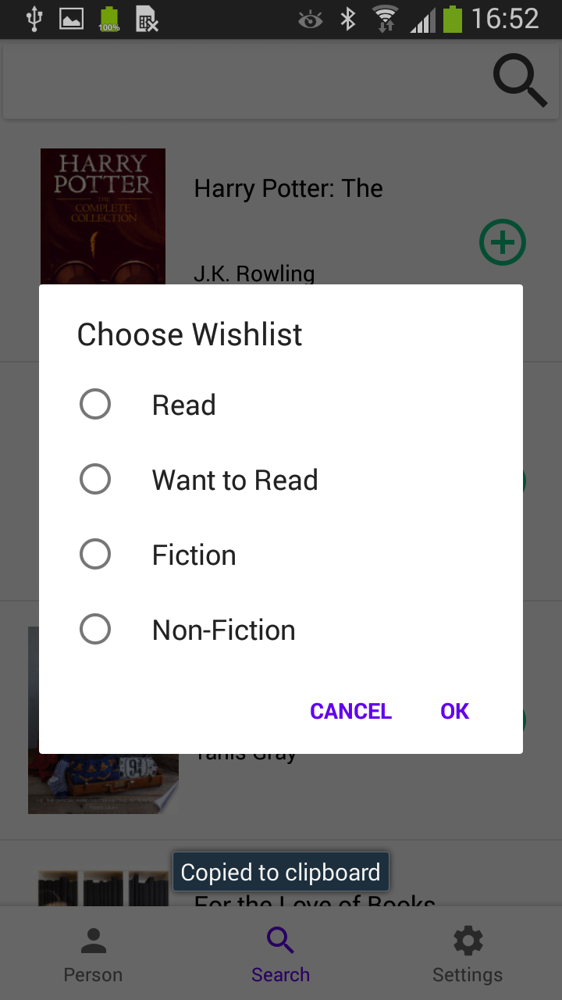
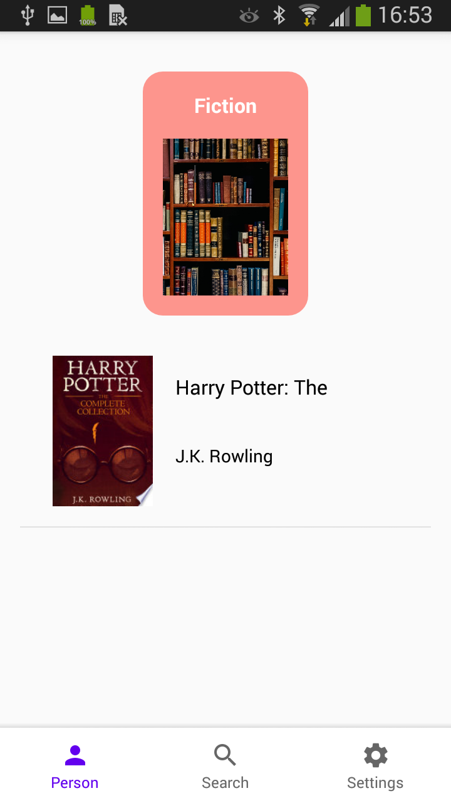
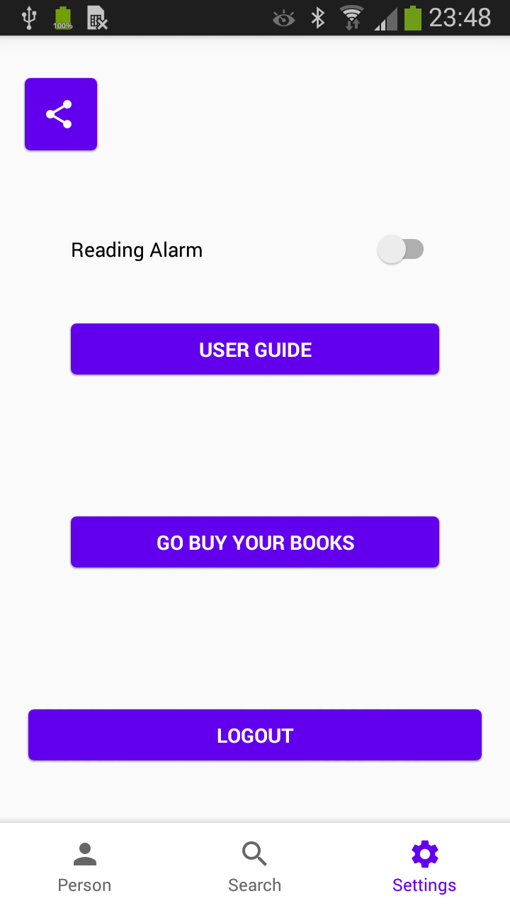

<h1 align = "center"> 📚 Readify 📚 </h1>

## Problem Statement 

People struggle to track books they have read or want to read. 

## Overview

The application is a book tracking app written in Java. A user can track the books they have read and want to read by adding books from the search section using the name of the book, the author or ISBN.

Users can add their books to four sections ‘read’, ‘want to read’, ‘fiction’, ‘non-fiction’.

Additionally, users can share books with there friends, set reading notifications and have a link to buy books.

### Sign Up/In Screens 

Google Firebase was usen to sign new users up and authenticate sign in.

  
   

### Search/Add Book screen

  
    

### Playlist

  

### Settings

  

